# AI Interview Backend

This is the backend for the AI Interview Platform, built with FastAPI and MongoDB. It provides APIs for user authentication, managing interview sessions, handling AI interactions, and managing questions.

## Technologies Used

*   **FastAPI**: A modern, fast (high-performance) web framework for building APIs with Python 3.7+ based on standard Python type hints.
*   **MongoDB**: A NoSQL document database used for data storage.
*   **Motor**: Asynchronous Python driver for MongoDB.
*   **Uvicorn**: An ASGI web server, used to run the FastAPI application.
*   **python-dotenv**: For loading environment variables from a `.env` file.
*   **CORS Middleware**: Enabled for cross-origin resource sharing.
*   **Static Files**: Serves uploaded files from the `/uploads` directory.

## Project Structure

```mermaid
graph TD
    A[AI Interview Backend] --> B[main.py]
    A --> C[config/]
    A --> D[controllers/]
    A --> E[middlewares/]
    A --> F[models/]
    A --> G[routes/]
    A --> H[utils/]
    A --> I[uploads/]

    C --> C1[database.py]
    D --> D1[ai_controller.py]
    D --> D2[auth_controller.py]
    D --> D3[question_controller.py]
    D --> D4[session_controller.py]
    E --> E1[auth_middlewares.py]
    F --> F1[question_model.py]
    F --> F2[session_model.py]
    F --> F3[user_model.py]
    G --> G1[ai_routes.py]
    G --> G2[auth_routes.py]
    G --> G3[question_routes.py]
    G --> G4[session_routes.py]
    G --> G5[upload_routes.py]
    H --> H1[auth.py]
    H --> H2[hash.py]
    H --> H3[helper.py]
    H --> H4[prompt.py]
```



*   [`main.py`](main.py): The main application file and entry point for the FastAPI application.
*   [`config/`](config/): Contains configuration files, such as `database.py` for MongoDB connection.
*   [`controllers/`](controllers/): Implements the business logic for various API endpoints.
*   [`middlewares/`](middlewares/): Contains custom middleware, such as authentication middleware.
*   [`models/`](models/): Defines the data models and schemas for MongoDB documents.
*   [`routes/`](routes/): Defines the API routes and links them to the respective controller functions.
*   [`utils/`](utils/): Provides utility functions for common tasks like authentication, hashing, and helper functions.
*   [`uploads/`](uploads/): Directory for storing static files uploaded through the application.

## Getting Started

### Prerequisites

*   Python 3.7+
*   MongoDB Instance (local or cloud-based)

### Installation

1.  **Clone the repository:**
    ```bash
    git clone <repository_url>
    cd AI-Interview-Backend
    ```

2.  **Create a virtual environment:**
    ```bash
    python -m venv myenv
    ```

3.  **Activate the virtual environment:**
    *   **Windows:**
        ```bash
        .\myenv\Scripts\activate
        ```
    *   **macOS/Linux:**
        ```bash
        source myenv/bin/activate
        ```

4.  **Create necessary directories:**
    You must create the `uploads` directory for static file serving:
    ```bash
    mkdir uploads
    ```

5.  **Install dependencies:**
    ```bash
    pip install -r requirements.txt
    ```
    *(Note: You might need to create a `requirements.txt` file first if it doesn't exist by running `pip freeze > requirements.txt`)*

6.  **Configure Environment Variables:**
    Create a file named `.env` in the root directory and populate it with the required variables:
    ```ini
    MONGO_URI=mongodb://localhost:27017/<YOUR PROJECT NAME>
    JWT_SECRET=<YOUR_SECRET_KEY>
    GEMINI_API_KEY=<YOUR GEMINI API KEY>
    ```
    **Note:** Replace `<YOUR_SECRET_KEY>` with a strong, randomly generated string. The `GEMINI_API_KEY` is commented out as it may not be universally required.

### Running the Application

To run the FastAPI application using Uvicorn:

```bash
uvicorn main:app --reload
```

This will start the server, typically on port 8000 (as configured in `.env`). The `--reload` flag enables auto-reloading on code changes during development.

## API Documentation

Once the server is running, you can access the interactive API documentation (Swagger UI) at:

```
http://127.0.0.1:8000/docs
```

Or the ReDoc documentation at:

```
http://127.0.0.1:8000/redoc
